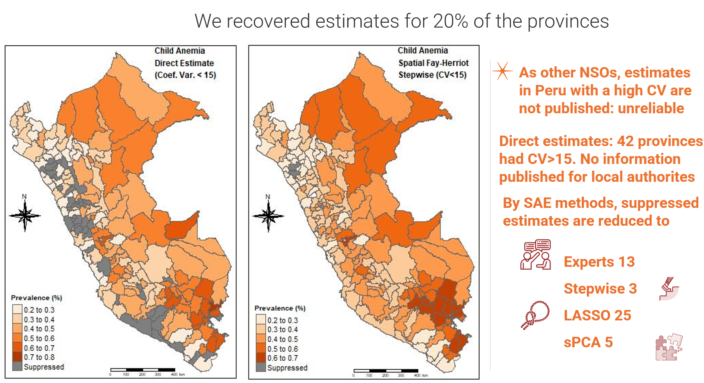
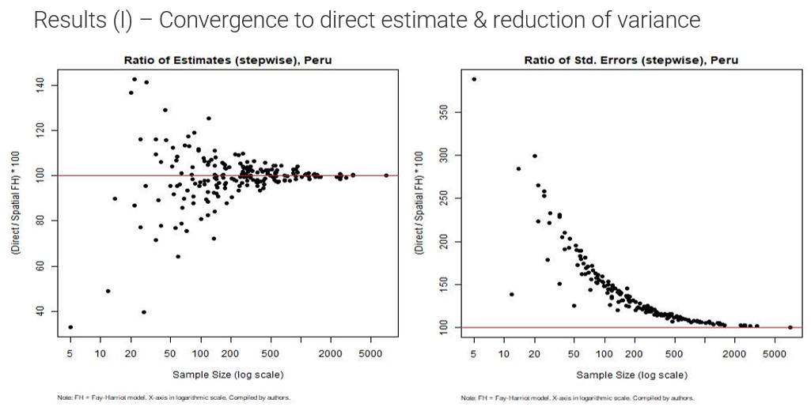

# SAE-ML: Machine Learning for Small Area Estimation



## Overview
This repository contains the replication material for the project **"Exploiting Data to its Fullest"**. The project explores the integration of **Machine Learning (ML)** and **Small Area Estimation (SAE)** techniques to enhance **covariate selection** for statistical modeling.

### Project Team:
- **Angelo Cozzubo**
- **Carolina Franco**

## Project Motivation
### Why Small Area Estimation (SAE)?
By leveraging auxiliary data sources, SAE techniques are used to improve statistical estimates for subpopulations or small geographic areas. These methods are widely applied in official statistics, including:
- Poverty estimation
- Health coverage analysis
- Labor statistics
- Election monitoring

### Why Machine Learning (ML)?
ML provides efficient tools for handling large datasets and automating variable selection. By combining ML with SAE, we aim to **improve covariate selection** and **enhance the accuracy** of small area estimates.

## Application: Estimating Anemia Prevalence in Peru
Our study focuses on estimating **anemia prevalence among children under five in Peru** at the second subnational level (provinces). The primary data source is the **Demographic and Health Survey (Endes)** (2017-2019). **The dataset is not included in this repository as it contains private data provided by the Peruvian National Statistical Office.**

**Challenges:**
- Official statistics are available only at the regional level due to reliability constraints.
- Direct estimations at the province level often fail to meet quality standards.
- Need for improved inference methods to support policymaking.

### Key Findings
- **Fay-Herriot spatial models** significantly reduce the variance of estimates.
- **Stepwise regression** proved to be the most effective variable selection method.
- **SAE techniques recovered estimates for 39 out of 42 provinces** where direct estimates were suppressed.
- The approach **helped identify 30,000 children with anemia** who would have been overlooked by direct survey methods.


*Comparison of direct estimates and SAE model estimates and standard errors at the province level.*

## Methodology
### 1. Small Area Estimation Models Used
- **Fay-Herriot Model (FH)**
- **Spatial Fay-Herriot Model (SFH)** (accounts for geographic proximity)

### 2. Variable Selection Techniques Explored
- **LASSO Regression**
- **Sparse Principal Component Analysis (sPCA)**
- **Stepwise Regression** (Best performing method)
- **Expert Opinion-Based Selection**

### 3. Alternative Approaches
- **Auto MrP (Multilevel Regression with Post-Stratification + ML)**
- **Binomial Logit Normal Models** (recommended for future research)

## Repository Structure
```
├── 02_scripts/       # R scripts for data processing and analysis
├── images/           # Visualizations and figures for README
├── README.md         # Project description
├── LICENSE           # MIT License
```

## Getting Started
### Prerequisites
- **R (>=4.0)**
- Required R packages:
  ```r
  install.packages(c("survey", "sae", "glmnet", "StepReg", "sparsepca"))
  ```

### Running the Analysis
1. Clone the repository:
   ```bash
   git clone https://github.com/acozzubo/SAE-ML.git
   ```
2. Navigate to the scripts folder:
   ```bash
   cd SAE-ML/02_scripts
   ```
3. Run the main analysis script:
   ```r
   source("main_analysis.R")
   ```

## Results and Impact
- SAE models **substantially reduced the standard errors** of anemia prevalence estimates.
- Policymakers can now **target interventions more effectively** using localized data.
- The project demonstrates a **scalable framework** for applying ML to SAE in other domains.

## Presentations and Dissemination
This project has been presented at various venues, including:
- **ISI Conference 2023**
- **ECLAC Workshops in Brazil**
- Other academic and policy-oriented events

## Future Research Directions
- Integrating **categorical and ordinal SAE models** for severity levels of anemia.
- Exploring **Bayesian hierarchical models** for improved uncertainty estimation.
- Applying **ML-based imputation techniques** to enrich auxiliary datasets.

## Citation
If you use this repository, please cite:
```
Cozzubo, A., Franco, C. (2022). Exploiting Data to its Fullest: Machine Learning for Small Area Estimation.
Venture Fund Project, NORC.
```

## License
This project is licensed under the **MIT License** - see the [LICENSE](LICENSE) file for details.

## Acknowledgments
We thank the **Peruvian National Statistical Office**, **NORC**, and all subject matter experts who contributed to this research.

---

🚀 **For more details, explore the repository or contact us via GitHub Issues!**
